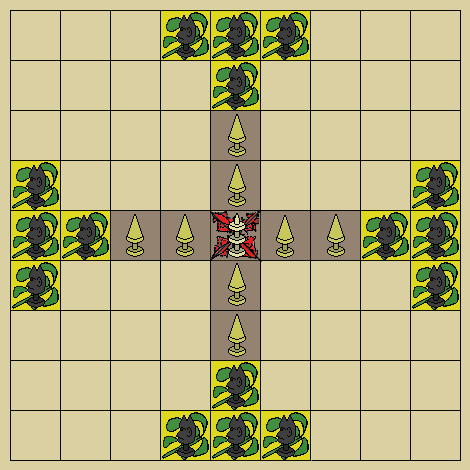

# Tablut

## How to run

* Open SICStus inside ``src/`` folder
* Type ``['main.pl'].``
* Type ``main.``

**Note:** Maximize the terminal for a better experience.

## Game Rules

Source: [Wikipedia](https://en.wikipedia.org/wiki/Tafl_games#Reconstruction)

* ✓ The game is played on a 9×9 board. Initial setup is as shown.
* ✓ The king starts on the central square or castle, called the konakis, which no other piece may ever occupy.
* ✓ The eight defenders, called Swedes, start on the eight squares adjoining the konakis, in the form of a cross.
* ✓ The sixteen attackers, called Muscovites, start in groups of four at the centre of each edge of the board. (In Linnaeus' notes, these squares were embroidered to signify them as the domain of the Muscovites.)
* ✓ All remaining squares (neutral zone) may be occupied by any piece during the game.
* ✓ Any piece may move any number of vacant spaces in any straight line [←↑→↓], but not diagonally. (Cf. rook in chess.)
* ✗ No piece may ever pass over another piece in its path.
* ✗ If the king should ever have an unimpeded path (through the neutral zone) to the edge of the board, unless he is immediately blocked by a Muscovite, he may escape and the game is over. (This rule suggests that the king may not escape through the domain of the Muscovites.)
* ✗ If the king should ever have a path of escape, he must call out "raichi"; if two paths of escape, then his escape is imminent and he must call out "tuichu". (Cf. "check" and "checkmate" in chess.)
* ✗ Any piece, except the king, may be captured and removed from the board if it becomes surrounded on two opposite sides by enemies. (This is known as custodial capture.)
* ✗ If the king is surrounded on all four sides by enemies, he is taken prisoner. If he is surrounded on three sides, he may escape by the fourth.
* ✗ If the king is on a square adjoining the konakis and is surrounded on three sides by his enemies and the fourth by the konakis, he is captured. (This rule suggests that once the king has left the konakis, he can never return.)
* ✗ If the king is captured, the Swedes are conquered and the Muscovites are victorious.
